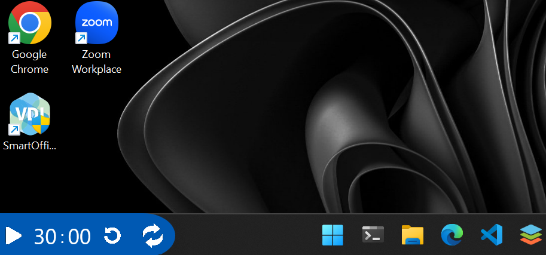
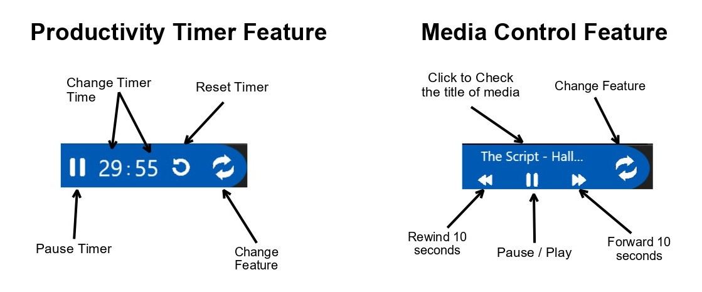

# Dynamic Island Windows🏝️

This is a WPF app for Apple's Dynamic Island like features for Windows 11 OS. 💻

It brings Dynamic Island concept to Windows, offering productivity Timer ⏲️ & Media 📽️Control—all in a sleek, interactive pill at bottom left corner of screen.

It sits on leftmost part of taskbar which doesnt crowd your screen. ☺️

<center></center>

## Installation

1. Clone the repository or Download the zip file. ⬇️

2. Create a certificate and store it in your **Trusted Root Certification Authority**. 🪪

3. Get the path of .pfx file and run the below command. (password is optional, if not there : omit "\p <password>"). This is required to verify authenticity for elevated access when displayed at the top of the screen.

```powershell
signtool sign /fdws /f "<certificate_path>\<certificate_name>.pfx" /p "<password>" /td certHash /fd SHA256 /as ".\bin\Release\net8.0-windows10.0.22621.0\DynamicIsland.exe"
```

4. Install the exe to **Program Files** folder to comply with Windows security policy and  prevent privilege escalation.

```powershell
Get-ChildItem -Path ".\bin\Release\net8.0-windows10.0.22621.0" -File | Copy-Item -Destination "C:\Program Files\Ayman\DynamicIsland" -Force
```

5. Launch DynamicIsland.exe 🚀

## Usage 🚀

Below are the buttons and tutorials to use the Dynamic Island features.



## Contributing

This project is still under development and welcomes your help!

* Report bugs 🐞 or request features via **Issues** ⚠️. 
* Submit pull requests 💁 for enhancements or fixes 🔨.
* Review the current codebase with patience—refactoring is in progress. 😌
  
  

Check out my website for more info [ayman-tech.github.io](https://ayman-tech.github.io) 🌐
